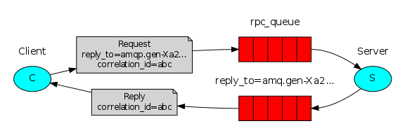

## RabbitMQ

### RabbitMQ 的概念 

RabbitMQ 是一个消息中间件：它接受并转发消息。

你可以把它当做一个快递站点，当你要发送一个包裹时，你把你的包裹放到快递站，快递员最终会把你的快递送到收件人那里，按照这种逻辑 RabbitMQ 是 一个快递站，一个快递员帮你传递快件。

RabbitMQ 与快递站的主要区别在于，它不处理快件而是接收， 存储和转发消息数据。

官网：<https://www.rabbitmq.com/#features>

### 四大核心概念

- 生产者

  产生数据发送消息的程序是生产者

- 交换机

  交换机是 RabbitMQ 非常重要的一个部件，一方面它接收来自生产者的消息，另一方面它将消息 推送到队列中。交换机必须确切知道如何处理它接收到的消息，是将这些消息推送到特定队列还是推 送到多个队列，亦或者是把消息丢弃，这个得有交换机类型决定

- 队列

  队列是 RabbitMQ 内部使用的一种数据结构，尽管消息流经 RabbitMQ 和应用程序，但它们只能存 储在队列中。队列仅受主机的内存和磁盘限制的约束，本质上是一个大的消息缓冲区。许多生产者可 以将消息发送到一个队列，许多消费者可以尝试从一个队列接收数据。这就是我们使用队列的方式

- 消费者

  消费与接收具有相似的含义。消费者大多时候是一个等待接收消息的程序。请注意生产者，消费 者和消息中间件很多时候并不在同一机器上。同一个应用程序既可以是生产者又是可以是消费者。

### 各个名词介绍 

- Broker

  接收和分发消息的应用，RabbitMQ Server 就是 Message Broker

- Virtual host

  出于多租户和安全因素设计的，把 AMQP 的基本组件划分到一个虚拟的分组中，类似 于网络中的 namespace 概念。当多个不同的用户使用同一个 RabbitMQ server 提供的服务时，可以划分出 多个 vhost，每个用户在自己的 vhost 创建 exchange／queue 等

- Connection

  publisher／consumer 和 broker 之间的 TCP 连接

- Channel

  如果每一次访问 RabbitMQ 都建立一个 Connection，在消息量大的时候建立 TCP Connection 的开销将是巨大的，效率也较低。Channel 是在 connection 内部建立的逻辑连接，如果应用程 序支持多线程，通常每个 thread 创建单独的 channel 进行通讯，AMQP method 包含了 channel id 帮助客 户端和 message broker 识别 channel，所以 channel 之间是完全隔离的。Channel 作为轻量级的 Connection 极大减少了操作系统建立 TCP connection 的开销 

- Exchange

  message 到达 broker 的第一站，根据分发规则，匹配查询表中的 routing key，分发 消息到 queue 中去。常用的类型有：direct (point-to-point), topic (publish-subscribe) and fanout (multicast)

- Queue

  消息最终被送到这里等待 consumer 取走

- Binding

  exchange 和 queue 之间的虚拟连接，binding 中可以包含 routing key，Binding 信息被保 存到 exchange 中的查询表中，用于 message 的分发依据

### RabbitMQ特点

- 可靠性。支持持久化，传输确认，发布确认等保证了MQ的可靠性。
- 灵活的分发消息策略。这应该是RabbitMQ的一大特点。在消息进入MQ前由Exchange(交换机)进行路由消息。分发消息策略有：简单模式、工作队列模式、发布订阅模式、路由模式、通配符模式。
- 支持集群。多台RabbitMQ服务器可以组成一个集群，形成一个逻辑Broker。
- 多种协议。RabbitMQ支持多种消息队列协议，比如 STOMP、MQTT 等等。
- 支持多种语言客户端。RabbitMQ几乎支持所有常用编程语言，包括 Java、.NET、Ruby 等等。
- 可视化管理界面。RabbitMQ提供了一个易用的用户界面，使得用户可以监控和管理消息 Broker。
- 插件机制。RabbitMQ提供了许多插件，可以通过插件进行扩展，也可以编写自己的插件。

### RabbitMQ的消息模型

#### 1. 简单模型

在上图中：

- p：生成者
- C：消费者
- 红色部分：quene，消息队列

#### 2. 工作模型

在上图中：

- p：生成者
- C1、C2：消费者
- 红色部分：quene，消息队列

当消息处理比较耗时时，就会出现生产消息的速度远远大于消费消息的速度，这样就会出现消息堆积，无法及时处理。这时就可以让**多个消费者绑定一个队列，去消费消息**，队列中的消息一旦消费就会丢失，因此任务不会重复执行。

#### 3. 广播模型（fanout）

这种模型中生产者发送的消息所有消费者都可以消费。

在上图中：

- p：生成者
- X：交换机
- C1、C2：消费者
- 红色部分：quene，消息队列

#### 4. 路由模型（routing）

这种模型消费者发送的消息，不同类型的消息可以由不同的消费者去消费。

在上图中：

- p：生成者
- X：交换机，接收到生产者的消息后将消息投递给与routing key完全匹配的队列
- C1、C2：消费者
- 红色部分：quene，消息队列

#### 5. 订阅模型（topic）

这种模型和direct模型一样，都是可以根据routing key将消息路由到不同的队列，只不过这种模型可以让队列绑定routing key 的时候使用通配符。这种类型的routing key都是由一个或多个单词组成，多个单词之间用`.`分割。

通配符介绍：

**`\*`：只匹配一个单词**

**`#`：匹配一个或多个单词**

#### 6. RPC模型

这种模式需要通知远程计算机运行功能并等待返回运行结果。这个过程是阻塞的。

当客户端启动时，它创建一个匿名独占回调队列。并提供名字为call的函数，这个call会发送RPC请求并且阻塞直到收到RPC运算的结果。

## **💡RabbitMQ环境**

##### windows

Windows下载地址：https://www.rabbitmq.com/install-windows.html

进去之后可以直接找到**Direct Downloads**，下载相关EXE程序进行安装就可以了。

由于RabbitMQ是由erlang语言编写的，所以安装之前我们还需要安装erlang环境，你下载RabbitMQ之后直接点击安装，如果没有相关环境，安装程序会提示你，然后会让你的浏览器打开erlang的下载页面，在这个页面上根据自己的系统类型点击下载安装即可，安装完毕后再去安装RabbitMQ。

这两者的安装都只需要一直NEXT下一步就可以了。

