# Kafka 入门一篇文章就够了

* [Kafka 入门一篇文章就够了](#kafka-入门一篇文章就够了)
   * [初识 Kafka](#初识-kafka)
      * [什么是 Kafka](#什么是-kafka)
      * [Kafka 的基本术语](#kafka-的基本术语)
      * [Kafka 的特性（设计原则）](#kafka-的特性设计原则)
      * [Kafka 的使用场景](#kafka-的使用场景)
      * [Kafka 的消息队列](#kafka-的消息队列)
      * [Kafka 系统架构](#kafka-系统架构)
      * [核心 API](#核心-api)
      * [Kafka 为何如此之快](#kafka-为何如此之快)
   * [Kafka 安装和重要配置](#kafka-安装和重要配置)
      * [broker 端配置](#broker-端配置)
      * [主题默认配置](#主题默认配置)
      * [JVM 参数配置](#jvm-参数配置)
   * [Kafka Producer](#kafka-producer)
      * [创建 Kafka 生产者](#创建-kafka-生产者)
      * [Kafka 消息发送](#kafka-消息发送)
      * [简单消息发送](#简单消息发送)
      * [同步发送消息](#同步发送消息)
      * [异步发送消息](#异步发送消息)
      * [生产者分区机制](#生产者分区机制)
         * [分区策略](#分区策略)
      * [生产者压缩机制](#生产者压缩机制)
         * [Kafka 压缩是什么](#kafka-压缩是什么)
      * [Kafka 重要参数配置](#kafka-重要参数配置)
   * [Kafka Consumer](#kafka-consumer)
      * [消费者组和分区重平衡](#消费者组和分区重平衡)
         * [消费者组是什么](#消费者组是什么)
         * [消费者重平衡](#消费者重平衡)
      * [创建消费者](#创建消费者)
         * [主题订阅](#主题订阅)
         * [轮询](#轮询)
      * [消费者配置](#消费者配置)
      * [提交和偏移量的概念](#提交和偏移量的概念)
         * [特殊偏移](#特殊偏移)
         * [自动提交](#自动提交)
         * [提交当前偏移量](#提交当前偏移量)
         * [异步提交](#异步提交)
         * [同步和异步组合提交](#同步和异步组合提交)
         * [提交特定的偏移量](#提交特定的偏移量)

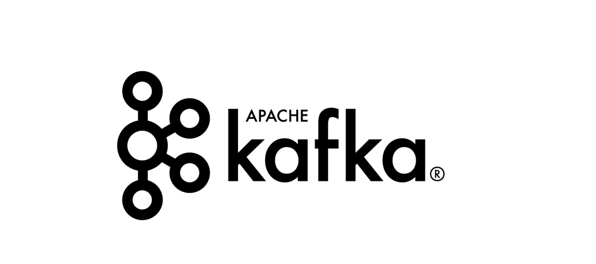


## 初识 Kafka

### 什么是 Kafka

Kafka 是由 `Linkedin` 公司开发的，它是一个分布式的，支持多分区、多副本，基于 Zookeeper 的分布式消息流平台，它同时也是一款开源的**基于发布订阅模式的消息引擎系统**。

### Kafka 的基本术语

消息：Kafka 中的数据单元被称为`消息`，也被称为记录，可以把它看作数据库表中某一行的记录。

批次：为了提高效率， 消息会`分批次`写入 Kafka，批次就代指的是一组消息。

主题：消息的种类称为 `主题`（Topic）,可以说一个主题代表了一类消息。相当于是对消息进行分类。主题就像是数据库中的表。

分区：主题可以被分为若干个分区（partition），同一个主题中的分区可以不在一个机器上，有可能会部署在多个机器上，由此来实现 kafka 的`伸缩性`，单一主题中的分区有序，但是无法保证主题中所有的分区有序

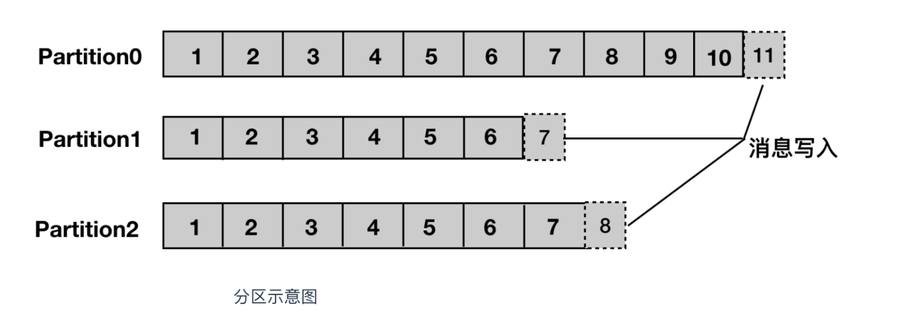


生产者： 向主题发布消息的客户端应用程序称为`生产者`（Producer），生产者用于持续不断的向某个主题发送消息。

消费者：订阅主题消息的客户端程序称为`消费者`（Consumer），消费者用于处理生产者产生的消息。

消费者群组：生产者与消费者的关系就如同餐厅中的厨师和顾客之间的关系一样，一个厨师对应多个顾客，也就是一个生产者对应多个消费者，`消费者群组`（Consumer Group）指的就是由一个或多个消费者组成的群体。

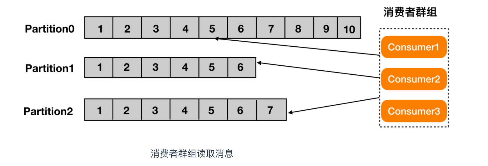


偏移量：`偏移量`（Consumer Offset）是一种元数据，它是一个不断递增的整数值，用来记录消费者发生重平衡时的位置，以便用来恢复数据。

broker: 一个独立的 Kafka 服务器就被称为 `broker`，broker 接收来自生产者的消息，为消息设置偏移量，并提交消息到磁盘保存。

broker 集群：broker 是`集群` 的组成部分，broker 集群由一个或多个 broker 组成，每个集群都有一个 broker 同时充当了`集群控制器`的角色（自动从集群的活跃成员中选举出来）。

副本：Kafka 中消息的备份又叫做 `副本`（Replica），副本的数量是可以配置的，Kafka 定义了两类副本：领导者副本（Leader Replica） 和 追随者副本（Follower Replica），前者对外提供服务，后者只是被动跟随。

重平衡：Rebalance。消费者组内某个消费者实例挂掉后，其他消费者实例自动重新分配订阅主题分区的过程。Rebalance 是 Kafka 消费者端实现高可用的重要手段。

### Kafka 的特性（设计原则）

* `高吞吐、低延迟`：kakfa 最大的特点就是收发消息非常快，kafka 每秒可以处理几十万条消息，它的最低延迟只有几毫秒。
* `高伸缩性`： 每个主题(topic) 包含多个分区(partition)，主题中的分区可以分布在不同的主机(broker)中。
* `持久性、可靠性`： Kafka 能够允许数据的持久化存储，消息被持久化到磁盘，并支持数据备份防止数据丢失，Kafka 底层的数据存储是基于 Zookeeper 存储的，Zookeeper 我们知道它的数据能够持久存储。
* `容错性`： 允许集群中的节点失败，某个节点宕机，Kafka 集群能够正常工作
* `高并发`： 支持数千个客户端同时读写

### Kafka 的使用场景

* 活动跟踪：Kafka 可以用来跟踪用户行为，比如我们经常回去淘宝购物，你打开淘宝的那一刻，你的登陆信息，登陆次数都会作为消息传输到 Kafka ，当你浏览购物的时候，你的浏览信息，你的搜索指数，你的购物爱好都会作为一个个消息传递给 Kafka ，这样就可以生成报告，可以做智能推荐，购买喜好等。
* 传递消息：Kafka 另外一个基本用途是传递消息，应用程序向用户发送通知就是通过传递消息来实现的，这些应用组件可以生成消息，而不需要关心消息的格式，也不需要关心消息是如何发送的。
* 度量指标：Kafka也经常用来记录运营监控数据。包括收集各种分布式应用的数据，生产各种操作的集中反馈，比如报警和报告。
* 日志记录：Kafka 的基本概念来源于提交日志，比如我们可以把数据库的更新发送到 Kafka 上，用来记录数据库的更新时间，通过kafka以统一接口服务的方式开放给各种consumer，例如hadoop、Hbase、Solr等。
* 流式处理：流式处理是有一个能够提供多种应用程序的领域。
* 限流削峰：Kafka 多用于互联网领域某一时刻请求特别多的情况下，可以把请求写入Kafka 中，避免直接请求后端程序导致服务崩溃。

### Kafka 的消息队列

Kafka 的消息队列一般分为两种模式：点对点模式和发布订阅模式

Kafka 是支持消费者群组的，也就是说 Kafka 中会有一个或者多个消费者，如果一个生产者生产的消息由一个消费者进行消费的话，那么这种模式就是点对点模式


如果一个生产者或者多个生产者产生的消息能够被多个消费者同时消费的情况，这样的消息队列成为发布订阅模式的消息队列

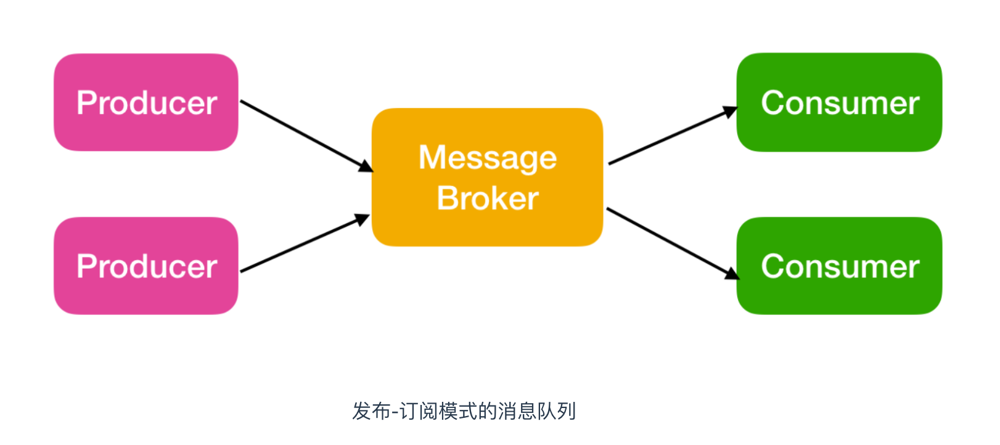


### Kafka 系统架构

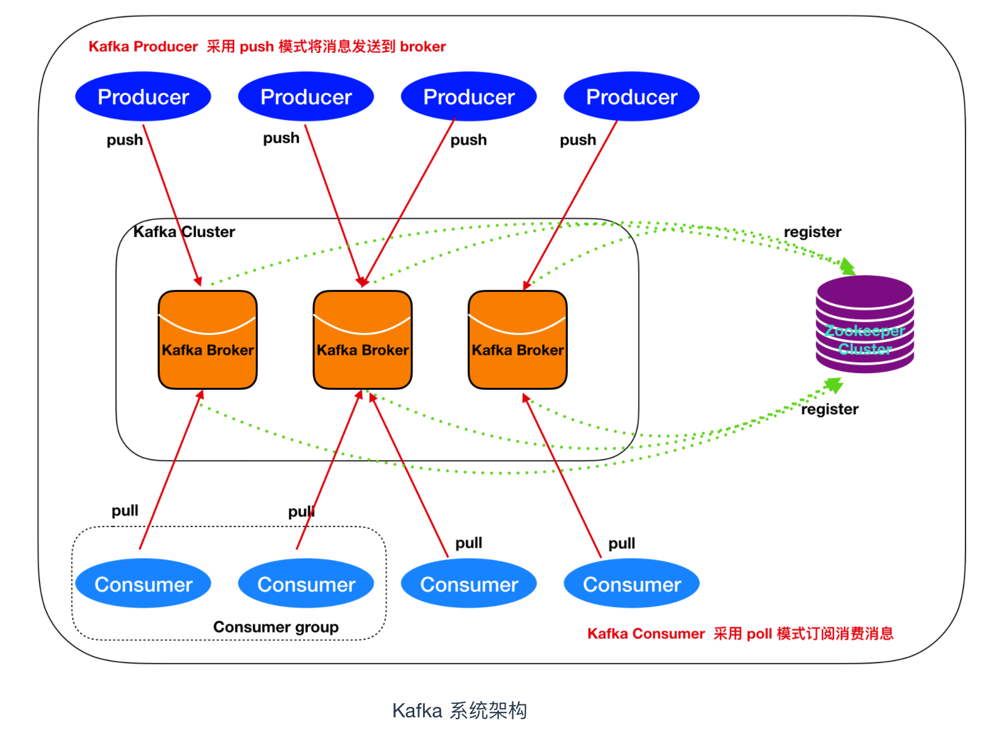


如上图所示，一个典型的 Kafka 集群中包含若干Producer（可以是web前端产生的Page View，或者是服务器日志，系统CPU、Memory等），若干broker（Kafka支持水平扩展，一般broker数量越多，集群吞吐率越高），若干Consumer Group，以及一个Zookeeper集群。Kafka通过Zookeeper管理集群配置，选举leader，以及在Consumer Group发生变化时进行rebalance。Producer使用push模式将消息发布到broker，Consumer使用pull模式从broker订阅并消费消息。

### 核心 API

Kafka 有四个核心API，它们分别是

* Producer API，它允许应用程序向一个或多个 topics 上发送消息记录
* Consumer API，允许应用程序订阅一个或多个 topics 并处理为其生成的记录流
* Streams API，它允许应用程序作为流处理器，从一个或多个主题中消费输入流并为其生成输出流，有效的将输入流转换为输出流。
* Connector API，它允许构建和运行将 Kafka 主题连接到现有应用程序或数据系统的可用生产者和消费者。例如，关系数据库的连接器可能会捕获对表的所有更改

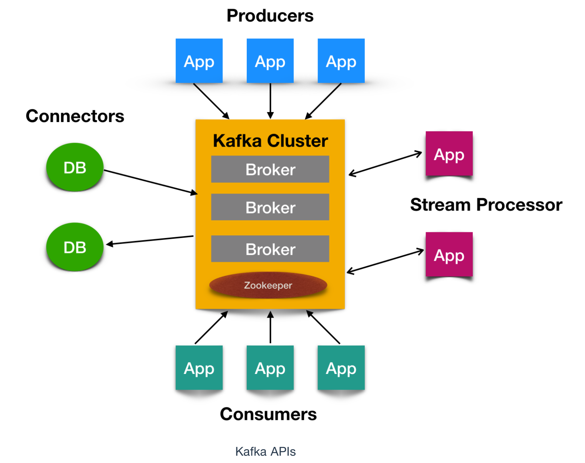


### Kafka 为何如此之快

Kafka 实现了`零拷贝`原理来快速移动数据，避免了内核之间的切换。Kafka 可以将数据记录分批发送，从生产者到文件系统（Kafka 主题日志）到消费者，可以端到端的查看这些批次的数据。

批处理能够进行更有效的数据压缩并减少 I/O 延迟，Kafka 采取顺序写入磁盘的方式，避免了随机磁盘寻址的浪费，更多关于磁盘寻址的了解，请参阅 [程序员需要了解的硬核知识之磁盘](https://mp.weixin.qq.com/s?__biz=MzU2NDg0OTgyMA==&mid=2247484654&idx=1&sn=9b6f5aaad05a49416e8f30e6b86691ae&chksm=fc45f91dcb32700b683b9a13d0d94d261171d346333d73967a4d501de3ecc273d67e8251aeae&token=674527772&lang=zh_CN#rd) 。

总结一下其实就是四个要点

* 顺序读写
* 零拷贝
* 消息压缩
* 分批发送

## Kafka 安装和重要配置

Kafka 安装我在 Kafka 系列第一篇应该比较详细了，详情见[带你涨姿势的认识一下kafka](https://mp.weixin.qq.com/s?__biz=MzU2NDg0OTgyMA==&mid=2247484570&idx=1&sn=1ad1c96bc7d47b88e976cbd045baf7d7&chksm=fc45f969cb32707f882c52d7434b2c0bf2ccbbc2cd854e1dc5c203deb8ae9c1831cf216e8bad&token=674527772&lang=zh_CN#rd) 这篇文章。

那我们还是主要来说一下 Kafka 中的重要参数配置吧，这些参数对 Kafka 来说是非常重要的。

### broker 端配置

* broker.id

每个 kafka broker 都有一个唯一的标识来表示，这个唯一的标识符即是 broker.id，它的默认值是 0。这个值在 kafka 集群中必须是唯一的，这个值可以任意设定，

* port

如果使用配置样本来启动 kafka，它会监听 9092 端口。修改 port 配置参数可以把它设置成任意的端口。要注意，如果使用 1024 以下的端口，需要使用 root 权限启动 kakfa。

* zookeeper.connect

用于保存 broker 元数据的 Zookeeper 地址是通过 zookeeper.connect 来指定的。比如我可以这么指定 `localhost:2181` 表示这个 Zookeeper 是运行在本地 2181 端口上的。我们也可以通过 比如我们可以通过 `zk1:2181,zk2:2181,zk3:2181` 来指定 zookeeper.connect 的多个参数值。该配置参数是用冒号分割的一组 `hostname:port/path` 列表，其含义如下

hostname 是 Zookeeper 服务器的机器名或者 ip 地址。

port 是 Zookeeper 客户端的端口号

/path 是可选择的 Zookeeper 路径，Kafka 路径是使用了 `chroot` 环境，如果不指定默认使用跟路径。

>如果你有两套 Kafka 集群，假设分别叫它们 kafka1 和 kafka2，那么两套集群的`zookeeper.connect`参数可以这样指定：`zk1:2181,zk2:2181,zk3:2181/kafka1`和`zk1:2181,zk2:2181,zk3:2181/kafka2`

* log.dirs 

Kafka 把所有的消息都保存到磁盘上，存放这些日志片段的目录是通过 `log.dirs` 来制定的，它是用一组逗号来分割的本地系统路径，log.dirs 是没有默认值的，**你必须手动指定他的默认值**。其实还有一个参数是 `log.dir`，如你所知，这个配置是没有 `s` 的，默认情况下只用配置 log.dirs 就好了，比如你可以通过 `/home/kafka1,/home/kafka2,/home/kafka3` 这样来配置这个参数的值。

* num.recovery.threads.per.data.dir

对于如下3种情况，Kafka 会使用`可配置的线程池`来处理日志片段。

服务器正常启动，用于打开每个分区的日志片段；

服务器崩溃后重启，用于检查和截断每个分区的日志片段；

服务器正常关闭，用于关闭日志片段。

默认情况下，每个日志目录只使用一个线程。因为这些线程只是在服务器启动和关闭时会用到，所以完全可以设置大量的线程来达到井行操作的目的。特别是对于包含大量分区的服务器来说，一旦发生崩愤，在进行恢复时使用井行操作可能会省下数小时的时间。设置此参数时需要注意，所配置的数字对应的是 log.dirs 指定的单个日志目录。也就是说，如果 num.recovery.threads.per.data.dir 被设为 8，并且 log.dir 指定了 3 个路径，那么总共需要 24 个线程。

* auto.create.topics.enable

默认情况下，kafka 会使用三种方式来自动创建主题，下面是三种情况：

当一个生产者开始往主题写入消息时

当一个消费者开始从主题读取消息时

当任意一个客户端向主题发送元数据请求时

`auto.create.topics.enable`参数我建议最好设置成 false，即不允许自动创建 Topic。在我们的线上环境里面有很多名字稀奇古怪的 Topic，我想大概都是因为该参数被设置成了 true 的缘故。

### 主题默认配置

Kafka 为新创建的主题提供了很多默认配置参数，下面就来一起认识一下这些参数

- num.partitions

num.partitions 参数指定了新创建的主题需要包含多少个分区。如果启用了主题自动创建功能（该功能是默认启用的），主题分区的个数就是该参数指定的值。该参数的默认值是 1。要注意，我们可以增加主题分区的个数，但不能减少分区的个数。

- default.replication.factor

这个参数比较简单，它表示 kafka保存消息的副本数，如果一个副本失效了，另一个还可以继续提供服务default.replication.factor 的默认值为1，这个参数在你启用了主题自动创建功能后有效。

- log.retention.ms

Kafka 通常根据时间来决定数据可以保留多久。默认使用 log.retention.hours 参数来配置时间，默认是 168 个小时，也就是一周。除此之外，还有两个参数 log.retention.minutes 和 log.retentiion.ms 。这三个参数作用是一样的，都是决定消息多久以后被删除，推荐使用 log.retention.ms。

- log.retention.bytes

另一种保留消息的方式是判断消息是否过期。它的值通过参数 `log.retention.bytes` 来指定，作用在每一个分区上。也就是说，如果有一个包含 8 个分区的主题，并且 log.retention.bytes 被设置为 1GB，那么这个主题最多可以保留 8GB 数据。所以，当主题的分区个数增加时，整个主题可以保留的数据也随之增加。

- log.segment.bytes

上述的日志都是作用在日志片段上，而不是作用在单个消息上。当消息到达 broker 时，它们被追加到分区的当前日志片段上，当日志片段大小到达 log.segment.bytes 指定上限（默认为 1GB）时，当前日志片段就会被关闭，一个新的日志片段被打开。如果一个日志片段被关闭，就开始等待过期。这个参数的值越小，就越会频繁的关闭和分配新文件，从而降低磁盘写入的整体效率。

- log.segment.ms

上面提到日志片段经关闭后需等待过期，那么 `log.segment.ms` 这个参数就是指定日志多长时间被关闭的参数和，log.segment.ms 和 log.retention.bytes 也不存在互斥问题。日志片段会在大小或时间到达上限时被关闭，就看哪个条件先得到满足。

- message.max.bytes

broker 通过设置 `message.max.bytes` 参数来限制单个消息的大小，默认是 1000 000， 也就是 1MB，如果生产者尝试发送的消息超过这个大小，不仅消息不会被接收，还会收到 broker 返回的错误消息。跟其他与字节相关的配置参数一样，该参数指的是压缩后的消息大小，也就是说，只要压缩后的消息小于 mesage.max.bytes，那么消息的实际大小可以大于这个值

这个值对性能有显著的影响。值越大，那么负责处理网络连接和请求的线程就需要花越多的时间来处理这些请求。它还会增加磁盘写入块的大小，从而影响 IO 吞吐量。

* retention.ms

规定了该主题消息被保存的时常，默认是7天，即该主题只能保存7天的消息，一旦设置了这个值，它会覆盖掉 Broker 端的全局参数值。

* retention.bytes

`retention.bytes`：规定了要为该 Topic 预留多大的磁盘空间。和全局参数作用相似，这个值通常在多租户的 Kafka 集群中会有用武之地。当前默认值是 -1，表示可以无限使用磁盘空间。

### JVM 参数配置

JDK 版本一般推荐直接使用 JDK1.8，这个版本也是现在中国大部分程序员的首选版本。

说到 JVM 端设置，就绕不开`堆`这个话题，业界最推崇的一种设置方式就是直接将 JVM 堆大小设置为 6GB，这样会避免很多 Bug 出现。

JVM 端配置的另一个重要参数就是垃圾回收器的设置，也就是平时常说的 `GC` 设置。如果你依然在使用 Java 7，那么可以根据以下法则选择合适的垃圾回收器：

- 如果 Broker 所在机器的 CPU 资源非常充裕，建议使用 CMS 收集器。启用方法是指定`-XX:+UseCurrentMarkSweepGC`。
- 否则，使用吞吐量收集器。开启方法是指定`-XX:+UseParallelGC`。

当然了，如果你已经在使用 Java 8 了，那么就用默认的 G1 收集器就好了。在没有任何调优的情况下，G1 表现得要比 CMS 出色，主要体现在更少的 Full GC，需要调整的参数更少等，所以使用 G1 就好了。

一般 G1 的调整只需要这两个参数即可

* MaxGCPauseMillis

该参数指定每次垃圾回收默认的停顿时间。该值不是固定的，G1可以根据需要使用更长的时间。它的默认值是 200ms，也就是说，每一轮垃圾回收大概需要200 ms 的时间。

* InitiatingHeapOccupancyPercent

该参数指定了 G1 启动新一轮垃圾回收之前可以使用的堆内存百分比，默认值是45，这就表明G1在堆使用率到达45之前不会启用垃圾回收。这个百分比包括新生代和老年代。

## Kafka Producer

在 Kafka 中，我们把产生消息的那一方称为`生产者`，比如我们经常回去淘宝购物，你打开淘宝的那一刻，你的登陆信息，登陆次数都会作为消息传输到 Kafka 后台，当你浏览购物的时候，你的浏览信息，你的搜索指数，你的购物爱好都会作为一个个消息传递给 Kafka 后台，然后淘宝会根据你的爱好做智能推荐，致使你的钱包从来都禁不住诱惑，那么这些生产者产生的`消息`是怎么传到 Kafka 应用程序的呢？发送过程是怎么样的呢？

尽管消息的产生非常简单，但是消息的发送过程还是比较复杂的，如图

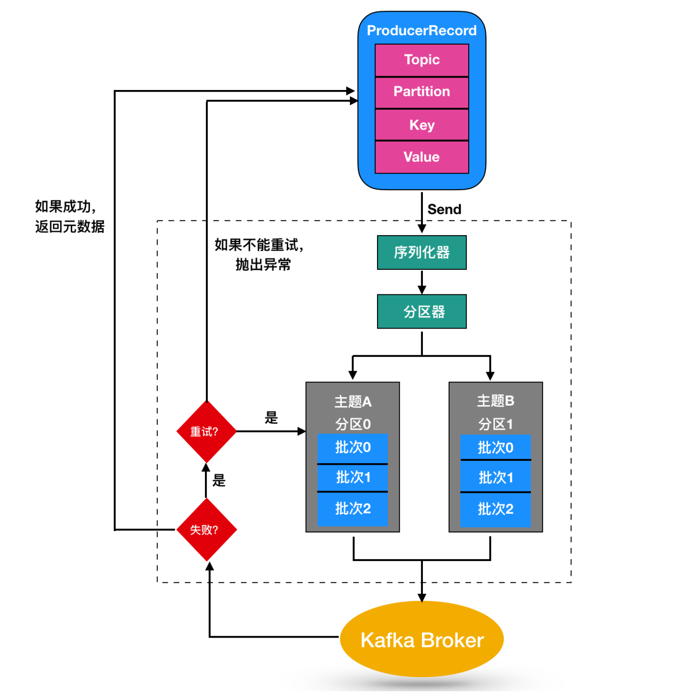

我们从创建一个`ProducerRecord` 对象开始，ProducerRecord 是 Kafka 中的一个核心类，它代表了一组 Kafka 需要发送的 `key/value` 键值对，它由记录要发送到的主题名称（Topic Name），可选的分区号（Partition Number）以及可选的键值对构成。

在发送 ProducerRecord 时，我们需要将键值对对象由序列化器转换为字节数组，这样它们才能够在网络上传输。然后消息到达了分区器。

如果发送过程中指定了有效的分区号，那么在发送记录时将使用该分区。如果发送过程中未指定分区，则将使用key 的 hash 函数映射指定一个分区。如果发送的过程中既没有分区号也没有，则将以循环的方式分配一个分区。选好分区后，生产者就知道向哪个主题和分区发送数据了。

ProducerRecord 还有关联的时间戳，如果用户没有提供时间戳，那么生产者将会在记录中使用当前的时间作为时间戳。Kafka 最终使用的时间戳取决于 topic 主题配置的时间戳类型。

- 如果将主题配置为使用 `CreateTime`，则生产者记录中的时间戳将由 broker 使用。
- 如果将主题配置为使用`LogAppendTime`，则生产者记录中的时间戳在将消息添加到其日志中时，将由 broker 重写。

然后，这条消息被存放在一个记录批次里，这个批次里的所有消息会被发送到相同的主题和分区上。由一个独立的线程负责把它们发到 Kafka Broker 上。

Kafka Broker 在收到消息时会返回一个响应，如果写入成功，会返回一个 RecordMetaData 对象，**它包含了主题和分区信息，以及记录在分区里的偏移量，上面两种的时间戳类型也会返回给用户**。如果写入失败，会返回一个错误。生产者在收到错误之后会尝试重新发送消息，几次之后如果还是失败的话，就返回错误消息。

### 创建 Kafka 生产者

要向 Kafka 写入消息，首先需要创建一个生产者对象，并设置一些属性。Kafka 生产者有3个必选的属性

* bootstrap.servers

该属性指定 broker 的地址清单，地址的格式为 `host:port`。清单里不需要包含所有的 broker 地址，生产者会从给定的 broker 里查找到其他的 broker 信息。不过建议至少要提供`两个` broker 信息，一旦其中一个宕机，生产者仍然能够连接到集群上。 

* key.serializer

broker 需要接收到序列化之后的 `key/value `值，所以生产者发送的消息需要经过序列化之后才传递给 Kafka Broker。生产者需要知道采用何种方式把 Java 对象转换为字节数组。key.serializer 必须被设置为一个实现了`org.apache.kafka.common.serialization.Serializer` 接口的类，生产者会使用这个类把键对象序列化为字节数组。这里拓展一下 Serializer 类

Serializer 是一个接口，它表示类将会采用何种方式序列化，它的作用是把对象转换为字节，实现了 Serializer 接口的类主要有 `ByteArraySerializer`、`StringSerializer`、`IntegerSerializer` ，其中 ByteArraySerialize 是 Kafka 默认使用的序列化器，其他的序列化器还有很多，你可以通过 [这里](https://kafka.apache.org/23/javadoc/index.html?org/apache/kafka/clients/producer/KafkaProducer.html) 查看其他序列化器。要注意的一点：**key.serializer 是必须要设置的，即使你打算只发送值的内容**。

* value.serializer

与 key.serializer 一样，value.serializer 指定的类会将值序列化。

下面代码演示了如何创建一个 Kafka 生产者，这里只指定了必要的属性，其他使用默认的配置

```java
private Properties properties = new Properties();
properties.put("bootstrap.servers","broker1:9092,broker2:9092");
properties.put("key.serializer","org.apache.kafka.common.serialization.StringSerializer");
properties.put("value.serializer","org.apache.kafka.common.serialization.StringSerializer");
properties = new KafkaProducer<String,String>(properties);
```

来解释一下这段代码

* 首先创建了一个 Properties 对象
* 使用 `StringSerializer` 序列化器序列化 key / value 键值对
* 在这里我们创建了一个新的生产者对象，并为键值设置了恰当的类型，然后把 Properties 对象传递给他。

### Kafka 消息发送

实例化生产者对象后，接下来就可以开始发送消息了，发送消息主要由下面几种方式

### 简单消息发送

Kafka 最简单的消息发送如下：

```java
ProducerRecord<String,String> record =
                new ProducerRecord<String, String>("CustomerCountry","West","France");

producer.send(record);
```

代码中生产者(producer)的 `send()` 方法需要把 `ProducerRecord` 的对象作为参数进行发送，ProducerRecord 有很多构造函数，这个我们下面讨论，这里调用的是

```java
public ProducerRecord(String topic, K key, V value) {}
```

这个构造函数，需要传递的是 topic主题，key 和 value。

把对应的参数传递完成后，生产者调用 send() 方法发送消息（ProducerRecord对象）。我们可以从生产者的架构图中看出，消息是先被写入分区中的缓冲区中，然后分批次发送给 Kafka Broker。

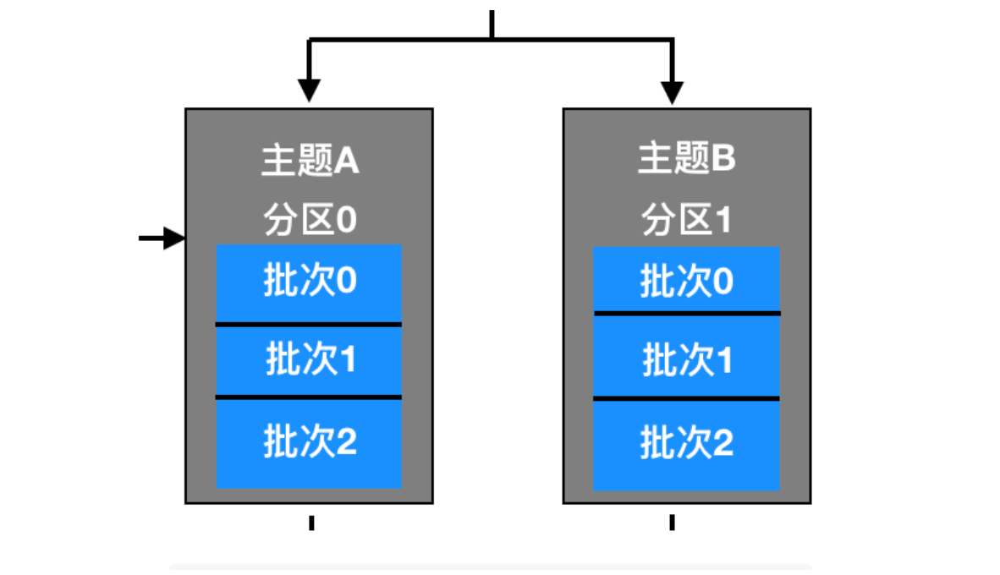


发送成功后，send() 方法会返回一个 `Future(java.util.concurrent)` 对象，Future 对象的类型是 `RecordMetadata` 类型，我们上面这段代码没有考虑返回值，所以没有生成对应的 Future 对象，所以没有办法知道消息是否发送成功。如果不是很重要的信息或者对结果不会产生影响的信息，可以使用这种方式进行发送。

我们可以忽略发送消息时可能发生的错误或者在服务器端可能发生的错误，但在消息发送之前，生产者还可能发生其他的异常。这些异常有可能是 `SerializationException(序列化失败)`，`BufferedExhaustedException 或 TimeoutException(说明缓冲区已满)`，又或是 `InterruptedException(说明发送线程被中断)`

### 同步发送消息

第二种消息发送机制如下所示

```java
ProducerRecord<String,String> record =
                new ProducerRecord<String, String>("CustomerCountry","West","France");

try{
  RecordMetadata recordMetadata = producer.send(record).get();
}catch(Exception e){
  e.printStackTrace()；
}

```

这种发送消息的方式较上面的发送方式有了改进，首先调用 send() 方法，然后再调用 get() 方法等待 Kafka 响应。如果服务器返回错误，get() 方法会抛出异常，如果没有发生错误，我们会得到 `RecordMetadata` 对象，可以用它来查看消息记录。

生产者（KafkaProducer）在发送的过程中会出现两类错误：其中一类是重试错误，这类错误可以通过重发消息来解决。比如连接的错误，可以通过再次建立连接来解决；无`主`错误则可以通过重新为分区选举首领来解决。KafkaProducer 被配置为自动重试，如果多次重试后仍无法解决问题，则会抛出重试异常。另一类错误是无法通过重试来解决的，比如`消息过大`对于这类错误，KafkaProducer 不会进行重试，直接抛出异常。

### 异步发送消息

同步发送消息都有个问题，那就是同一时间只能有一个消息在发送，这会造成许多消息无法直接发送，造成消息滞后，无法发挥效益最大化。

比如消息在应用程序和 Kafka 集群之间一个来回需要 10ms。如果发送完每个消息后都等待响应的话，那么发送100个消息需要 1 秒，但是如果是`异步`方式的话，发送 100 条消息所需要的时间就会少很多很多。大多数时候，虽然Kafka 会返回 `RecordMetadata` 消息，但是我们并不需要等待响应。

为了在异步发送消息的同时能够对异常情况进行处理，生产者提供了回掉支持。下面是回调的一个例子

```java
ProducerRecord<String, String> producerRecord = new ProducerRecord<String, String>("CustomerCountry", "Huston", "America");
        producer.send(producerRecord,new DemoProducerCallBack());


class DemoProducerCallBack implements Callback {

  public void onCompletion(RecordMetadata metadata, Exception exception) {
    if(exception != null){
      exception.printStackTrace();;
    }
  }
}
```

首先实现回调需要定义一个实现了`org.apache.kafka.clients.producer.Callback`的类，这个接口只有一个 `onCompletion`方法。如果 kafka 返回一个错误，onCompletion 方法会抛出一个非空(non null)异常，这里我们只是简单的把它打印出来，如果是生产环境需要更详细的处理，然后在 send() 方法发送的时候传递一个 Callback 回调的对象。

### 生产者分区机制

Kafka 对于数据的读写是以`分区`为粒度的，分区可以分布在多个主机（Broker）中，这样每个节点能够实现独立的数据写入和读取，并且能够通过增加新的节点来增加 Kafka 集群的吞吐量，通过分区部署在多个 Broker 来实现`负载均衡`的效果。

上面我们介绍了生产者的发送方式有三种：`不管结果如何直接发送`、`发送并返回结果`、`发送并回调`。由于消息是存在主题（topic）的分区（partition）中的，所以当 Producer 生产者发送产生一条消息发给 topic 的时候，你如何判断这条消息会存在哪个分区中呢？

这其实就设计到 Kafka 的分区机制了。

#### 分区策略

Kafka 的分区策略指的就是将生产者发送到哪个分区的算法。Kafka 为我们提供了默认的分区策略，同时它也支持你自定义分区策略。

如果要自定义分区策略的话，你需要显示配置生产者端的参数 `Partitioner.class`，我们可以看一下这个类它位于 `org.apache.kafka.clients.producer` 包下

```java
public interface Partitioner extends Configurable, Closeable {
  
  public int partition(String topic, Object key, byte[] keyBytes, Object value, byte[] valueBytes, Cluster cluster);

  public void close();
  
  default public void onNewBatch(String topic, Cluster cluster, int prevPartition) {}
}
```

Partitioner 类有三个方法，分别来解释一下

* partition(): 这个类有几个参数: `topic`，表示需要传递的主题；`key` 表示消息中的键值；`keyBytes`表示分区中序列化过后的key，byte数组的形式传递；`value` 表示消息的 value 值；`valueBytes` 表示分区中序列化后的值数组；`cluster`表示当前集群的原数据。Kafka 给你这么多信息，就是希望让你能够充分地利用这些信息对消息进行分区，计算出它要被发送到哪个分区中。
* close() : 继承了 `Closeable` 接口能够实现 close() 方法，在分区关闭时调用。
* onNewBatch(): 表示通知分区程序用来创建新的批次

其中与分区策略息息相关的就是 partition() 方法了，分区策略有下面这几种

**顺序轮询**

顺序分配，消息是均匀的分配给每个 partition，即每个分区存储一次消息。就像下面这样

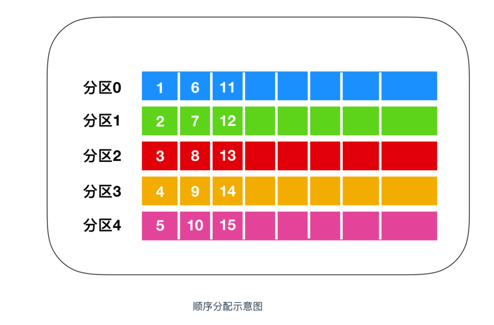


上图表示的就是轮询策略，轮训策略是 Kafka Producer 提供的默认策略，如果你不使用指定的轮训策略的话，Kafka 默认会使用顺序轮训策略的方式。

**随机轮询**

随机轮询简而言之就是随机的向 partition 中保存消息，如下图所示

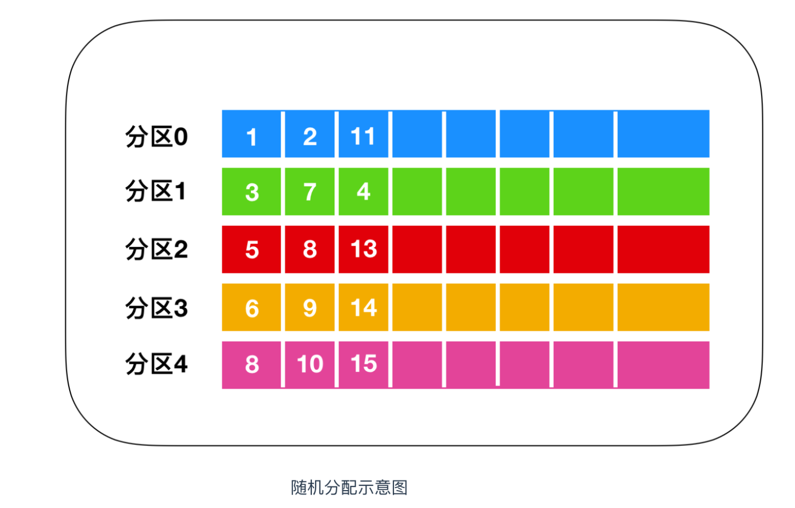


实现随机分配的代码只需要两行，如下

```java
List<PartitionInfo> partitions = cluster.partitionsForTopic(topic);
return ThreadLocalRandom.current().nextInt(partitions.size());
```

先计算出该主题总的分区数，然后随机地返回一个小于它的正整数。

本质上看随机策略也是力求将数据均匀地打散到各个分区，但从实际表现来看，它要逊于轮询策略，所以**如果追求数据的均匀分布，还是使用轮询策略比较好**。事实上，随机策略是老版本生产者使用的分区策略，在新版本中已经改为轮询了。

**按照 key 进行消息保存**

这个策略也叫做 **key-ordering** 策略，Kafka 中每条消息都会有自己的key，一旦消息被定义了 Key，那么你就可以保证同一个 Key 的所有消息都进入到相同的分区里面，由于每个分区下的消息处理都是有顺序的，故这个策略被称为按消息键保序策略，如下图所示

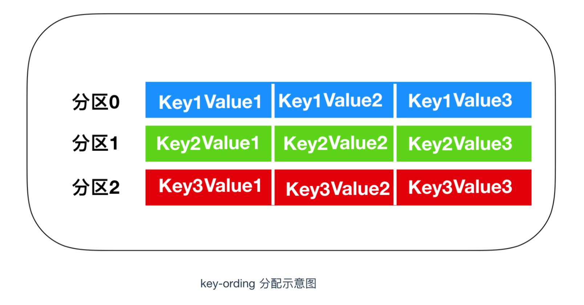

实现这个策略的 partition 方法同样简单，只需要下面两行代码即可：

```java
List<PartitionInfo> partitions = cluster.partitionsForTopic(topic);
return Math.abs(key.hashCode()) % partitions.size();
```

上面这几种分区策略都是比较基础的策略，除此之外，你还可以自定义分区策略。

### 生产者压缩机制

压缩一词简单来讲就是一种互换思想，它是一种经典的用 CPU 时间去换磁盘空间或者 I/O 传输量的思想，希望以较小的 CPU 开销带来更少的磁盘占用或更少的网络 I/O 传输。如果你还不了解的话我希望你先读完这篇文章 [程序员需要了解的硬核知识之压缩算法](https://mp.weixin.qq.com/s?__biz=MzU2NDg0OTgyMA==&mid=2247484672&idx=1&sn=7de8762995227b21f35c6bbb47b22233&chksm=fc45f8f3cb3271e5deac7e08d5dcdbfb24e3d66a1ac431fd78252bb0e0cb3cd1c727f053211a&token=343157109&lang=zh_CN#rd)，然后你就明白压缩是怎么回事了。

#### Kafka 压缩是什么

Kafka 的消息分为两层：消息集合 和 消息。一个消息集合中包含若干条日志项，而日志项才是真正封装消息的地方。Kafka 底层的消息日志由一系列消息集合日志项组成。Kafka 通常不会直接操作具体的一条条消息，它总是在消息集合这个层面上进行`写入`操作。

在 Kafka 中，压缩会发生在两个地方：Kafka Producer 和 Kafka Consumer，为什么启用压缩？说白了就是消息太大，需要`变小一点` 来使消息发的更快一些。

Kafka Producer 中使用 `compression.type` 来开启压缩

```java
private Properties properties = new Properties();
properties.put("bootstrap.servers","192.168.1.9:9092");
properties.put("key.serializer","org.apache.kafka.common.serialization.StringSerializer");
properties.put("value.serializer","org.apache.kafka.common.serialization.StringSerializer");
properties.put("compression.type", "gzip");

Producer<String,String> producer = new KafkaProducer<String, String>(properties);

ProducerRecord<String,String> record =
  new ProducerRecord<String, String>("CustomerCountry","Precision Products","France");
```

上面代码表明该 Producer 的压缩算法使用的是 GZIP

**有压缩必有解压缩**，Producer 使用压缩算法压缩消息后并发送给服务器后，由 Consumer 消费者进行解压缩，因为采用的何种压缩算法是随着 key、value 一起发送过去的，所以消费者知道采用何种压缩算法。

### Kafka 重要参数配置

在上一篇文章 [带你涨姿势的认识一下kafka](https://mp.weixin.qq.com/s?__biz=MzU2NDg0OTgyMA==&mid=2247484570&idx=1&sn=1ad1c96bc7d47b88e976cbd045baf7d7&chksm=fc45f969cb32707f882c52d7434b2c0bf2ccbbc2cd854e1dc5c203deb8ae9c1831cf216e8bad&token=343157109&lang=zh_CN#rd)中，我们主要介绍了一下 kafka 集群搭建的参数，本篇文章我们来介绍一下 Kafka 生产者重要的配置，生产者有很多可配置的参数，在文档里（http://kafka.apache.org/documentation/#producerconfigs）都有说明，我们介绍几个在内存使用、性能和可靠性方面对生产者影响比较大的参数进行说明

**key.serializer**

用于 key 键的序列化，它实现了 `org.apache.kafka.common.serialization.Serializer` 接口

**value.serializer**

用于 value 值的序列化，实现了 `org.apache.kafka.common.serialization.Serializer` 接口

**acks**

acks 参数指定了要有多少个分区副本接收消息，生产者才认为消息是写入成功的。此参数对消息丢失的影响较大

* 如果 acks = 0，就表示生产者也不知道自己产生的消息是否被服务器接收了，它才知道它写成功了。如果发送的途中产生了错误，生产者也不知道，它也比较懵逼，因为没有返回任何消息。这就类似于 UDP 的运输层协议，只管发，服务器接受不接受它也不关心。
* 如果 acks = 1，只要集群的 Leader 接收到消息，就会给生产者返回一条消息，告诉它写入成功。如果发送途中造成了网络异常或者 Leader 还没选举出来等其他情况导致消息写入失败，生产者会受到错误消息，这时候生产者往往会再次重发数据。因为消息的发送也分为 `同步` 和 `异步`，Kafka 为了保证消息的高效传输会决定是同步发送还是异步发送。如果让客户端等待服务器的响应（通过调用 `Future` 中的 `get()` 方法），显然会增加延迟，如果客户端使用回调，就会解决这个问题。
* 如果 acks = all，这种情况下是只有当所有参与复制的节点都收到消息时，生产者才会接收到一个来自服务器的消息。不过，它的延迟比 acks =1 时更高，因为我们要等待不只一个服务器节点接收消息。

**buffer.memory**

此参数用来设置生产者内存缓冲区的大小，生产者用它缓冲要发送到服务器的消息。如果应用程序发送消息的速度超过发送到服务器的速度，会导致生产者空间不足。这个时候，send() 方法调用要么被阻塞，要么抛出异常，具体取决于 `block.on.buffer.null` 参数的设置。

**compression.type**

此参数来表示生产者启用何种压缩算法，默认情况下，消息发送时不会被压缩。该参数可以设置为 snappy、gzip 和 lz4，它指定了消息发送给 broker 之前使用哪一种压缩算法进行压缩。下面是各压缩算法的对比


**retries**

生产者从服务器收到的错误有可能是临时性的错误（比如分区找不到首领），在这种情况下，`reteis` 参数的值决定了生产者可以重发的消息次数，如果达到这个次数，生产者会放弃重试并返回错误。默认情况下，生产者在每次重试之间等待 100ms，这个等待参数可以通过 `retry.backoff.ms` 进行修改。

**batch.size**

当有多个消息需要被发送到同一个分区时，生产者会把它们放在同一个批次里。该参数指定了一个批次可以使用的内存大小，按照字节数计算。当批次被填满，批次里的所有消息会被发送出去。不过生产者井不一定都会等到批次被填满才发送，任意条数的消息都可能被发送。

**client.id**

此参数可以是任意的字符串，服务器会用它来识别消息的来源，一般配置在日志里

**max.in.flight.requests.per.connection**

此参数指定了生产者在收到服务器响应之前可以发送多少消息，它的值越高，就会占用越多的内存，不过也会提高吞吐量。把它设为1 可以保证消息是按照发送的顺序写入服务器。

**timeout.ms、request.timeout.ms 和 metadata.fetch.timeout.ms**

request.timeout.ms 指定了生产者在发送数据时等待服务器返回的响应时间，metadata.fetch.timeout.ms 指定了生产者在获取元数据（比如目标分区的首领是谁）时等待服务器返回响应的时间。如果等待时间超时，生产者要么重试发送数据，要么返回一个错误。timeout.ms 指定了 broker 等待同步副本返回消息确认的时间，与 asks 的配置相匹配----如果在指定时间内没有收到同步副本的确认，那么 broker 就会返回一个错误。

**max.block.ms**

此参数指定了在调用 send() 方法或使用 partitionFor() 方法获取元数据时生产者的阻塞时间当生产者的发送缓冲区已捕，或者没有可用的元数据时，这些方法就会阻塞。在阻塞时间达到 max.block.ms 时，生产者会抛出超时异常。

**max.request.size**

该参数用于控制生产者发送的请求大小。它可以指能发送的单个消息的最大值，也可以指单个请求里所有消息的总大小。

**receive.buffer.bytes 和 send.buffer.bytes**

Kafka 是基于 TCP 实现的，为了保证可靠的消息传输，这两个参数分别指定了 TCP Socket 接收和发送数据包的缓冲区的大小。如果它们被设置为 -1，就使用操作系统的默认值。如果生产者或消费者与 broker 处于不同的数据中心，那么可以适当增大这些值。

## Kafka Consumer

应用程序使用 `KafkaConsumer` 从 Kafka 中订阅主题并接收来自这些主题的消息，然后再把他们保存起来。应用程序首先需要创建一个 KafkaConsumer 对象，订阅主题并开始接受消息，验证消息并保存结果。一段时间后，生产者往主题写入的速度超过了应用程序验证数据的速度，这时候该如何处理？如果只使用单个消费者的话，应用程序会跟不上消息生成的速度，就像多个生产者像相同的主题写入消息一样，这时候就需要多个消费者共同参与消费主题中的消息，对消息进行分流处理。

Kafka 消费者从属于`消费者群组`。一个群组中的消费者订阅的都是`相同`的主题，每个消费者接收主题一部分分区的消息。下面是一个 Kafka 分区消费示意图

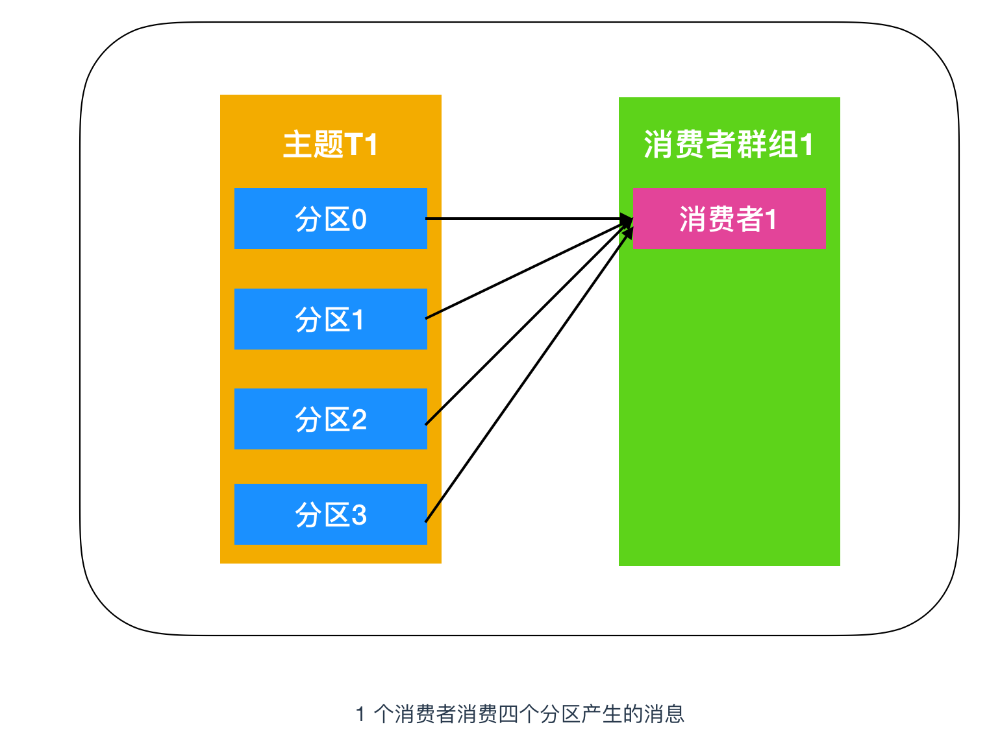


上图中的主题 T1 有四个分区，分别是分区0、分区1、分区2、分区3，我们创建一个消费者群组1，消费者群组中只有一个消费者，它订阅主题T1，接收到 T1 中的全部消息。由于一个消费者处理四个生产者发送到分区的消息，压力有些大，需要帮手来帮忙分担任务，于是就演变为下图


这样一来，消费者的消费能力就大大提高了，但是在某些环境下比如用户产生消息特别多的时候，生产者产生的消息仍旧让消费者吃不消，那就继续增加消费者。

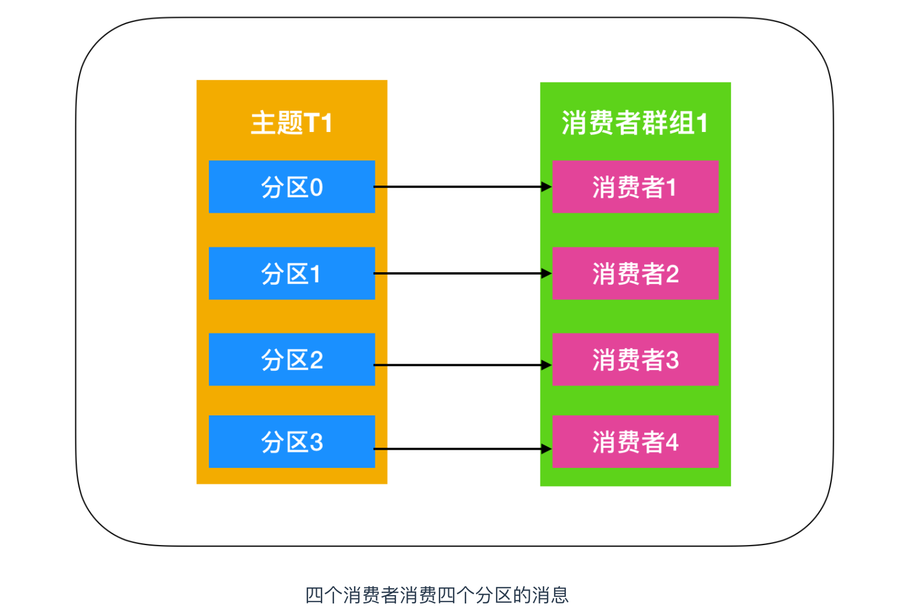


如上图所示，每个分区所产生的消息能够被每个消费者群组中的消费者消费，如果向消费者群组中增加更多的消费者，那么多余的消费者将会闲置，如下图所示

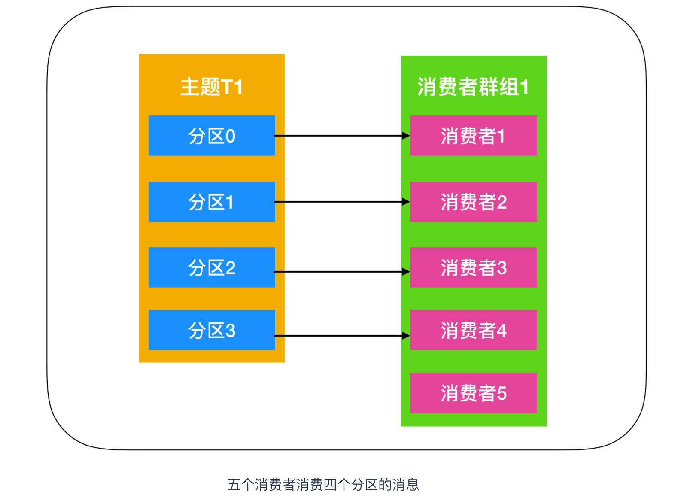


向群组中增加消费者是横向伸缩消费能力的主要方式。总而言之，我们可以通过增加消费组的消费者来进行`水平扩展提升消费能力`。这也是为什么建议创建主题时使用比较多的分区数，这样可以在消费负载高的情况下增加消费者来提升性能。另外，消费者的数量不应该比分区数多，因为多出来的消费者是空闲的，没有任何帮助。

Kafka 一个很重要的特性就是，只需写入一次消息，可以支持任意多的应用读取这个消息。换句话说，每个应用都可以读到全量的消息。为了使得每个应用都能读到全量消息，应用需要有不同的消费组。对于上面的例子，假如我们新增了一个新的消费组 G2，而这个消费组有两个消费者，那么就演变为下图这样


在这个场景中，消费组 G1 和消费组 G2 都能收到 T1 主题的全量消息，在逻辑意义上来说它们属于不同的应用。

**总结起来就是如果应用需要读取全量消息，那么请为该应用设置一个消费组；如果该应用消费能力不足，那么可以考虑在这个消费组里增加消费者**。

### 消费者组和分区重平衡

#### 消费者组是什么

`消费者组（Consumer Group）`是由一个或多个消费者实例（Consumer Instance）组成的群组，具有可扩展性和可容错性的一种机制。消费者组内的消费者`共享`一个消费者组ID，这个ID 也叫做 `Group ID`，组内的消费者共同对一个主题进行订阅和消费，同一个组中的消费者只能消费一个分区的消息，多余的消费者会闲置，派不上用场。

我们在上面提到了两种消费方式

* 一个消费者群组消费一个主题中的消息，这种消费模式又称为`点对点`的消费方式，点对点的消费方式又被称为消息队列
* 一个主题中的消息被多个消费者群组共同消费，这种消费模式又称为`发布-订阅`模式

#### 消费者重平衡

我们从上面的`消费者演变图`中可以知道这么一个过程：最初是一个消费者订阅一个主题并消费其全部分区的消息，后来有一个消费者加入群组，随后又有更多的消费者加入群组，而新加入的消费者实例`分摊`了最初消费者的部分消息，这种把分区的所有权通过一个消费者转到其他消费者的行为称为`重平衡`，英文名也叫做 `Rebalance` 。如下图所示


重平衡非常重要，它为消费者群组带来了`高可用性` 和 `伸缩性`，我们可以放心的添加消费者或移除消费者，不过在正常情况下我们并不希望发生这样的行为。在重平衡期间，消费者无法读取消息，造成整个消费者组在重平衡的期间都不可用。另外，当分区被重新分配给另一个消费者时，消息当前的读取状态会丢失，它有可能还需要去刷新缓存，在它重新恢复状态之前会拖慢应用程序。

消费者通过向`组织协调者`（Kafka Broker）发送心跳来维护自己是消费者组的一员并确认其拥有的分区。对于不同不的消费群体来说，其组织协调者可以是不同的。只要消费者定期发送心跳，就会认为消费者是存活的并处理其分区中的消息。当消费者检索记录或者提交它所消费的记录时就会发送心跳。

如果过了一段时间 Kafka 停止发送心跳了，会话（Session）就会过期，组织协调者就会认为这个 Consumer 已经死亡，就会触发一次重平衡。如果消费者宕机并且停止发送消息，组织协调者会等待几秒钟，确认它死亡了才会触发重平衡。在这段时间里，**死亡的消费者将不处理任何消息**。在清理消费者时，消费者将通知协调者它要离开群组，组织协调者会触发一次重平衡，尽量降低处理停顿。

重平衡是一把双刃剑，它为消费者群组带来高可用性和伸缩性的同时，还有有一些明显的缺点(bug)，而这些 bug 到现在社区还无法修改。

重平衡的过程对消费者组有极大的影响。因为每次重平衡过程中都会导致万物静止，参考 JVM 中的垃圾回收机制，也就是 Stop The World ，STW，(引用自《深入理解 Java 虚拟机》中 p76 关于 Serial 收集器的描述)：

>更重要的是它在进行垃圾收集时，必须暂停其他所有的工作线程。直到它收集结束。`Stop The World` 这个名字听起来很帅，但这项工作实际上是由虚拟机在后台自动发起并完成的，在用户不可见的情况下把用户正常工作的线程全部停掉，这对很多应用来说都是难以接受的。

也就是说，在重平衡期间，消费者组中的消费者实例都会停止消费，等待重平衡的完成。而且重平衡这个过程很慢......

### 创建消费者

上面的理论说的有点多，下面就通过代码来讲解一下消费者是如何消费的

在读取消息之前，需要先创建一个 `KafkaConsumer` 对象。创建 KafkaConsumer 对象与创建 KafkaProducer 对象十分相似 --- 把需要传递给消费者的属性放在 `properties` 对象中，后面我们会着重讨论 Kafka 的一些配置，这里我们先简单的创建一下，使用3个属性就足矣，分别是 `bootstrap.server`，`key.deserializer`，`value.deserializer` 。

这三个属性我们已经用过很多次了，如果你还不是很清楚的话，可以参考 [带你涨姿势是认识一下Kafka Producer](https://mp.weixin.qq.com/s/Br0_DQ854n-Is0W88DbPOg)

还有一个属性是 `group.id` 这个属性不是必须的，它指定了 KafkaConsumer 是属于哪个消费者群组。创建不属于任何一个群组的消费者也是可以的

```java
Properties properties = new Properties();
        properties.put("bootstrap.server","192.168.1.9:9092");     properties.put("key.serializer","org.apache.kafka.common.serialization.StringSerializer");   properties.put("value.serializer","org.apache.kafka.common.serialization.StringSerializer");
KafkaConsumer<String,String> consumer = new KafkaConsumer<>(properties);
```

#### 主题订阅

创建好消费者之后，下一步就开始订阅主题了。`subscribe()` 方法接受一个主题列表作为参数，使用起来比较简单

```java
consumer.subscribe(Collections.singletonList("customerTopic"));
```

为了简单我们只订阅了一个主题 `customerTopic`，参数传入的是一个正则表达式，正则表达式可以匹配多个主题，如果有人创建了新的主题，并且主题的名字与正则表达式相匹配，那么会立即触发一次重平衡，消费者就可以读取新的主题。

要订阅所有与 test 相关的主题，可以这样做

```java
consumer.subscribe("test.*");
```

#### 轮询

我们知道，Kafka 是支持订阅/发布模式的，生产者发送数据给 Kafka Broker，那么消费者是如何知道生产者发送了数据呢？其实生产者产生的数据消费者是不知道的，KafkaConsumer 采用轮询的方式定期去 Kafka Broker 中进行数据的检索，如果有数据就用来消费，如果没有就再继续轮询等待，下面是轮询等待的具体实现

```java
try {
  while (true) {
    ConsumerRecords<String, String> records = consumer.poll(Duration.ofSeconds(100));
    for (ConsumerRecord<String, String> record : records) {
      int updateCount = 1;
      if (map.containsKey(record.value())) {
        updateCount = (int) map.get(record.value() + 1);
      }
      map.put(record.value(), updateCount);
    }
  }
}finally {
  consumer.close();
}
```

* 这是一个无限循环。消费者实际上是一个长期运行的应用程序，它通过轮询的方式向 Kafka 请求数据。
* 第三行代码非常重要，Kafka 必须定期循环请求数据，否则就会认为该 Consumer 已经挂了，会触发重平衡，它的分区会移交给群组中的其它消费者。传给 `poll()` 方法的是一个超市时间，用 `java.time.Duration` 类来表示，如果该参数被设置为 0 ，poll() 方法会立刻返回，否则就会在指定的毫秒数内一直等待 broker 返回数据。
* poll() 方法会返回一个记录列表。每条记录都包含了记录所属主题的信息，记录所在分区的信息、记录在分区中的偏移量，以及记录的键值对。我们一般会遍历这个列表，逐条处理每条记录。
* 在退出应用程序之前使用 `close()` 方法关闭消费者。网络连接和 socket 也会随之关闭，并立即触发一次重平衡，而不是等待群组协调器发现它不再发送心跳并认定它已经死亡。

>**线程安全性**
>
>在同一个群组中，我们无法让一个线程运行多个消费者，也无法让多个线程安全的共享一个消费者。按照规则，一个消费者使用一个线程，如果一个消费者群组中多个消费者都想要运行的话，那么必须让每个消费者在自己的线程中运行，可以使用 Java 中的 `ExecutorService` 启动多个消费者进行进行处理。

### 消费者配置

到目前为止，我们学习了如何使用消费者 API，不过只介绍了几个最基本的属性，Kafka 文档列出了所有与消费者相关的配置说明。大部分参数都有合理的默认值，一般不需要修改它们，下面我们就来介绍一下这些参数。

* fetch.min.bytes

该属性指定了消费者从服务器获取记录的最小字节数。broker 在收到消费者的数据请求时，如果可用的数据量小于 `fetch.min.bytes` 指定的大小，那么它会等到有足够的可用数据时才把它返回给消费者。这样可以降低消费者和 broker 的工作负载，因为它们在主题使用频率不是很高的时候就不用来回处理消息。如果没有很多可用数据，但消费者的 CPU 使用率很高，那么就需要把该属性的值设得比默认值大。如果消费者的数量比较多，把该属性的值调大可以降低 broker 的工作负载。

* fetch.max.wait.ms

我们通过上面的 **fetch.min.bytes** 告诉 Kafka，等到有足够的数据时才会把它返回给消费者。而 **fetch.max.wait.ms** 则用于指定 broker 的等待时间，默认是 500 毫秒。如果没有足够的数据流入 kafka 的话，消费者获取的最小数据量要求就得不到满足，最终导致 500 毫秒的延迟。如果要降低潜在的延迟，就可以把参数值设置的小一些。如果 fetch.max.wait.ms 被设置为 100 毫秒的延迟，而 fetch.min.bytes 的值设置为 1MB，那么 Kafka 在收到消费者请求后，要么返回 1MB 的数据，要么在 100 ms 后返回所有可用的数据。就看哪个条件首先被满足。

* max.partition.fetch.bytes

该属性指定了服务器从每个分区里返回给消费者的`最大字节数`。它的默认值时 1MB，也就是说，`KafkaConsumer.poll()` 方法从每个分区里返回的记录最多不超过 max.partition.fetch.bytes 指定的字节。如果一个主题有20个分区和5个消费者，那么每个消费者需要`至少`4 MB的可用内存来接收记录。在为消费者分配内存时，可以给它们多分配一些，因为如果群组里有消费者发生崩溃，剩下的消费者需要处理更多的分区。max.partition.fetch.bytes 的值必须比 broker 能够接收的最大消息的字节数(通过 max.message.size 属性配置大)，**否则消费者可能无法读取这些消息，导致消费者一直挂起重试**。 在设置该属性时，另外一个考量的因素是消费者处理数据的时间。消费者需要频繁的调用 poll() 方法来避免会话过期和发生分区再平衡，如果单次调用poll() 返回的数据太多，消费者需要更多的时间进行处理，可能无法及时进行下一个轮询来避免会话过期。如果出现这种情况，可以把 max.partition.fetch.bytes 值改小，或者延长会话过期时间。

* session.timeout.ms

这个属性指定了消费者在被认为死亡之前可以与服务器断开连接的时间，默认是 3s。如果消费者没有在 **session.timeout.ms** 指定的时间内发送心跳给群组协调器，就会被认定为死亡，协调器就会触发重平衡。把它的分区分配给消费者群组中的其它消费者，此属性与 `heartbeat.interval.ms` 紧密相关。heartbeat.interval.ms 指定了 poll() 方法向群组协调器发送心跳的频率，session.timeout.ms 则指定了消费者可以多久不发送心跳。所以，这两个属性一般需要同时修改，heartbeat.interval.ms 必须比 session.timeout.ms 小，一般是 session.timeout.ms 的三分之一。如果 session.timeout.ms 是 3s，那么 heartbeat.interval.ms 应该是 1s。把 session.timeout.ms 值设置的比默认值小，可以更快地检测和恢复崩愤的节点，不过长时间的轮询或垃圾收集可能导致非预期的重平衡。把该属性的值设置得大一些，可以减少意外的重平衡，不过检测节点崩溃需要更长的时间。

* auto.offset.reset

该属性指定了消费者在读取一个没有偏移量的分区或者偏移量无效的情况下的该如何处理。它的默认值是 `latest`，意思指的是，在偏移量无效的情况下，消费者将从最新的记录开始读取数据。另一个值是 `earliest`，意思指的是在偏移量无效的情况下，消费者将从起始位置处开始读取分区的记录。

* enable.auto.commit

我们稍后将介绍几种不同的提交偏移量的方式。该属性指定了消费者是否自动提交偏移量，默认值是 true，为了尽量避免出现重复数据和数据丢失，可以把它设置为 false，由自己控制何时提交偏移量。如果把它设置为 true，还可以通过 **auto.commit.interval.ms** 属性来控制提交的频率

* partition.assignment.strategy

我们知道，分区会分配给群组中的消费者。`PartitionAssignor` 会根据给定的消费者和主题，决定哪些分区应该被分配给哪个消费者，Kafka 有两个默认的分配策略`Range` 和 `RoundRobin`

* client.id

该属性可以是任意字符串，broker 用他来标识从客户端发送过来的消息，通常被用在日志、度量指标和配额中

* max.poll.records

该属性用于控制单次调用 call() 方法能够返回的记录数量，可以帮你控制在轮询中需要处理的数据量。

* receive.buffer.bytes 和 send.buffer.bytes

socket 在读写数据时用到的 TCP 缓冲区也可以设置大小。如果它们被设置为 -1，就使用操作系统默认值。如果生产者或消费者与 broker 处于不同的数据中心内，可以适当增大这些值，因为跨数据中心的网络一般都有比较高的延迟和比较低的带宽。

### 提交和偏移量的概念

#### 特殊偏移

我们上面提到，消费者在每次调用`poll()` 方法进行定时轮询的时候，会返回由生产者写入 Kafka 但是还没有被消费者消费的记录，因此我们可以追踪到哪些记录是被群组里的哪个消费者读取的。消费者可以使用 Kafka 来追踪消息在分区中的位置（偏移量）

消费者会向一个叫做 `_consumer_offset` 的特殊主题中发送消息，这个主题会保存每次所发送消息中的分区偏移量，这个主题的主要作用就是消费者触发重平衡后记录偏移使用的，消费者每次向这个主题发送消息，正常情况下不触发重平衡，这个主题是不起作用的，当触发重平衡后，消费者停止工作，每个消费者可能会分到对应的分区，这个主题就是让消费者能够继续处理消息所设置的。

如果提交的偏移量小于客户端最后一次处理的偏移量，那么位于两个偏移量之间的消息就会被重复处理


如果提交的偏移量大于最后一次消费时的偏移量，那么处于两个偏移量中间的消息将会丢失


既然`_consumer_offset` 如此重要，那么它的提交方式是怎样的呢？下面我们就来说一下####提交方式

KafkaConsumer API 提供了多种方式来提交偏移量

#### 自动提交

最简单的方式就是让消费者自动提交偏移量。如果 `enable.auto.commit` 被设置为true，那么每过 5s，消费者会自动把从 poll() 方法轮询到的最大偏移量提交上去。提交时间间隔由 `auto.commit.interval.ms` 控制，默认是 5s。与消费者里的其他东西一样，自动提交也是在轮询中进行的。消费者在每次轮询中会检查是否提交该偏移量了，如果是，那么就会提交从上一次轮询中返回的偏移量。

#### 提交当前偏移量

把 `auto.commit.offset` 设置为 false，可以让应用程序决定何时提交偏移量。使用 `commitSync()` 提交偏移量。这个 API 会提交由 poll() 方法返回的最新偏移量，提交成功后马上返回，如果提交失败就抛出异常。

commitSync() 将会提交由 poll() 返回的最新偏移量，如果处理完所有记录后要确保调用了 commitSync()，否则还是会有丢失消息的风险，如果发生了在均衡，从最近一批消息到发生在均衡之间的所有消息都将被重复处理。

#### 异步提交

异步提交 `commitAsync()` 与同步提交 `commitSync()` 最大的区别在于异步提交不会进行重试，同步提交会一致进行重试。

#### 同步和异步组合提交

一般情况下，针对偶尔出现的提交失败，不进行重试不会有太大的问题，因为如果提交失败是因为临时问题导致的，那么后续的提交总会有成功的。但是如果在关闭消费者或再均衡前的最后一次提交，就要确保提交成功。

因此，**在消费者关闭之前一般会组合使用commitAsync和commitSync提交偏移量**。

#### 提交特定的偏移量

消费者API允许调用 commitSync() 和 commitAsync() 方法时传入希望提交的 partition 和 offset 的 map，即提交特定的偏移量。


