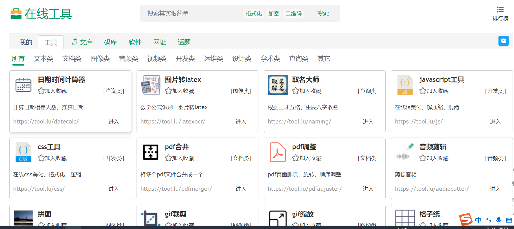
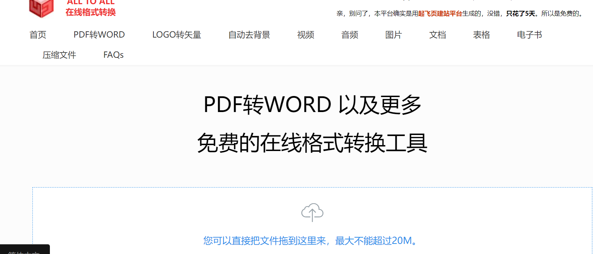

### 1.[在线工具](https://tool.lu/)

这是一个在线工具箱，包含文本类、图像类、视频类、开发类、运维类、设计类、学术类、查询类等共80多个小工具，其中还有颜色转换、放假计算器这些有趣的功能。

### 2.[万有导航](http://wanyouw.com/)

### 3.[工具123](http://www.gjw123.com/tags-wygj)

### 4.[虫部落](https://www.chongbuluo.com/)

虫部落是一个提供学术搜索、电子书搜索、图片搜索、资源搜索，涵盖多个搜索引擎，多个搜索路径的网站。

### 5.[199it](https://hao.199it.com/)

数据报告合集网站

### 6.[all to all](https://www.alltoall.net/)

文件格式转化

### 7.[优工具](https://www.toolbon.com/)

